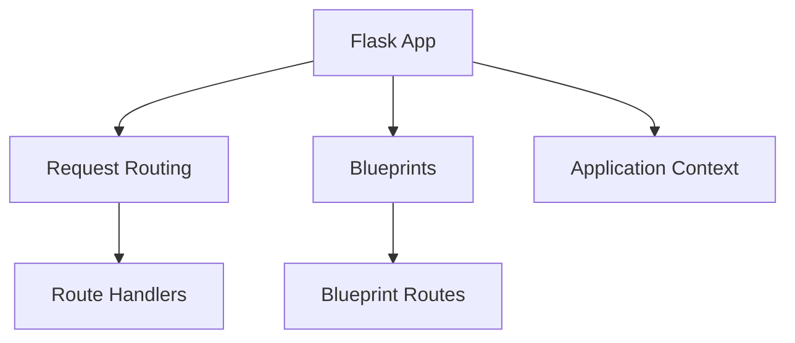
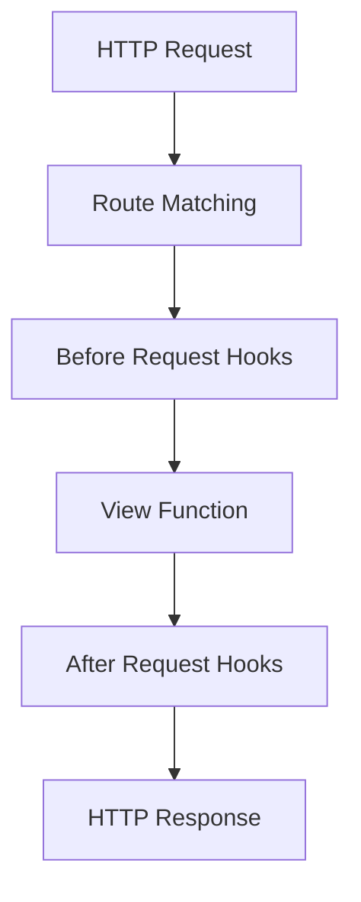
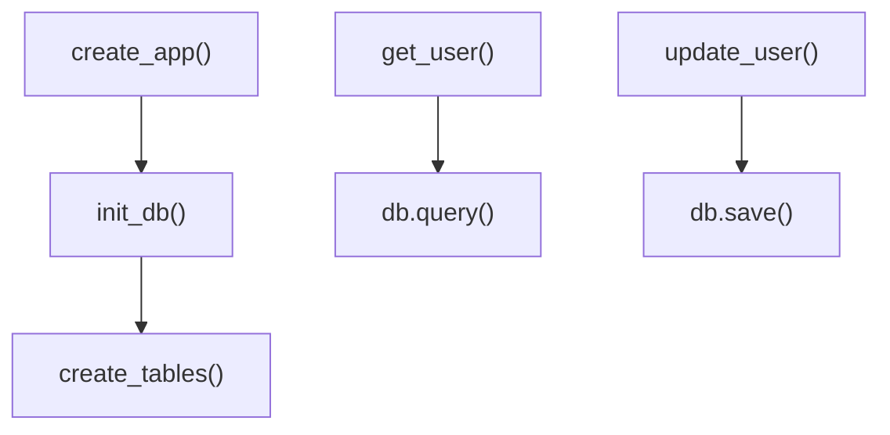

# Example Generated Documentation

This document shows an example of the type of documentation that Codebase Genius generates for a typical repository.

## Sample Repository

**Repository:** `pallets/flask`  
**URL:** https://github.com/pallets/flask  
**Generated:** 2024-12-10

---

# Flask Documentation - Generated by Codebase Genius

## 📋 Project Overview

### Summary

Flask is a lightweight WSGI web application framework written in Python. It is designed to make getting started quick and easy, with the ability to scale up to complex applications. It began as a simple wrapper around Werkzeug and Jinja2 and has become one of the most popular Python web frameworks.

**Key Highlights:**
- Micro-framework for building web applications
- Built on WSGI and Jinja2
- Minimalist but extensible design
- Comprehensive plugin ecosystem
- Excellent documentation and community support

### Repository Structure

```
flask/
├── src/
│   └── flask/
│       ├── __init__.py
│       ├── app.py
│       ├── ctx.py
│       ├── blueprint.py
│       ├── helpers.py
│       ├── wrappers.py
│       ├── sessions.py
│       └── ...
├── tests/
│   ├── test_basic.py
│   ├── test_blueprint.py
│   ├── test_app.py
│   └── ...
├── docs/
├── setup.py
└── README.md
```

### Statistics

| Metric | Value |
|--------|-------|
| Total Files | 45 |
| Python Files | 38 |
| Test Files | 12 |
| Lines of Code | ~8,500 |
| Main Classes | 7 |
| Public Functions | 24 |

---

## 🔧 Installation & Setup

### Prerequisites

- Python 3.7 or higher
- pip (Python package manager)
- Virtual environment (recommended)

### Installation

```bash
# Create virtual environment
python3 -m venv venv
source venv/bin/activate  # On Windows: venv\Scripts\activate

# Install Flask
pip install flask

# Or install from source
git clone https://github.com/pallets/flask.git
cd flask
pip install -e .
```

### Quick Test

```bash
# Create app.py
echo 'from flask import Flask
app = Flask(__name__)

@app.route("/")
def hello():
    return "Hello, World!"

if __name__ == "__main__":
    app.run(debug=True)' > app.py

# Run application
python app.py

# Visit http://localhost:5000
```

---

## 🏗️ Architecture

### Core Components



### Request/Response Cycle



---

## 📚 API Reference

### Core Classes

#### `Flask`

The main Flask application object.

```python
class Flask(name):
    """Create a new Flask application.
    
    Args:
        name: Application name, usually __name__
    
    Attributes:
        config (dict): Application configuration
        debug (bool): Debug mode flag
        env (str): Environment name
    """
```

**Key Methods:**

| Method | Description |
|--------|-------------|
| `route()` | Register a route handler |
| `run()` | Start the development server |
| `test_client()` | Create a test client |
| `before_request()` | Register before-request handler |
| `after_request()` | Register after-request handler |
| `errorhandler()` | Register error handler |

**Example:**

```python
from flask import Flask

app = Flask(__name__)

@app.route('/hello/<name>')
def hello(name):
    return f'Hello, {name}!'

@app.before_request
def before_request():
    print('Request starting')

@app.errorhandler(404)
def not_found(error):
    return 'Page not found', 404

if __name__ == '__main__':
    app.run(debug=True)
```

#### `Blueprint`

A way to organize a group of related views and other code.

```python
class Blueprint(name, import_name, ...):
    """Create a new Blueprint.
    
    Args:
        name: Name of the blueprint
        import_name: Name of the module/package
    """
```

**Example:**

```python
from flask import Blueprint

admin = Blueprint('admin', __name__, url_prefix='/admin')

@admin.route('/')
def admin_home():
    return 'Admin Home'

@admin.route('/users')
def users():
    return 'Users List'

# Register blueprint
app.register_blueprint(admin)
```

### Request/Response Objects

#### `request`

Global object representing the current HTTP request.

```python
from flask import request

@app.route('/submit', methods=['POST'])
def submit():
    name = request.form.get('name')
    data = request.get_json()
    return f'Received: {name}'
```

#### `response`

Create a custom HTTP response.

```python
from flask import make_response

@app.route('/custom')
def custom_response():
    resp = make_response('Response')
    resp.set_cookie('name', 'value')
    return resp
```

### Decorators

| Decorator | Purpose |
|-----------|---------|
| `@app.route(path)` | Define a route |
| `@app.before_request` | Hook before each request |
| `@app.after_request` | Hook after each request |
| `@app.errorhandler(code)` | Handle HTTP errors |
| `@login_required` | Require authentication |

---

## 🔄 Function Call Relationships



---

## 🧪 Testing

### Unit Testing

```python
import pytest
from app import create_app

@pytest.fixture
def client():
    app = create_app({'TESTING': True})
    with app.test_client() as client:
        yield client

def test_hello(client):
    rv = client.get('/hello')
    assert rv.status_code == 200
    assert b'Hello' in rv.data
```

### Running Tests

```bash
# Install pytest
pip install pytest

# Run all tests
pytest

# Run specific test
pytest tests/test_basic.py::test_hello

# With coverage
pip install pytest-cov
pytest --cov=app
```

---

## 📦 Dependencies

### Core Dependencies

| Package | Version | Purpose |
|---------|---------|---------|
| Werkzeug | >=2.0 | WSGI utilities |
| Jinja2 | >=3.0 | Template engine |
| click | >=7.1 | CLI utilities |
| itsdangerous | >=2.0 | Data signing |

### Development Dependencies

| Package | Purpose |
|---------|---------|
| pytest | Testing framework |
| coverage | Code coverage |
| black | Code formatting |
| flake8 | Linting |

---

## 🚀 Common Use Cases

### 1. Building a REST API

```python
from flask import Flask, jsonify, request

app = Flask(__name__)
users = []

@app.route('/api/users', methods=['GET'])
def get_users():
    return jsonify(users)

@app.route('/api/users', methods=['POST'])
def create_user():
    user = request.get_json()
    users.append(user)
    return jsonify(user), 201

@app.route('/api/users/<id>', methods=['GET'])
def get_user(id):
    user = next((u for u in users if u['id'] == id), None)
    return jsonify(user) if user else ('Not found', 404)
```

### 2. Template Rendering

```python
from flask import render_template

@app.route('/user/<name>')
def user(name):
    return render_template('user.html', name=name)
```

### 3. Session Management

```python
from flask import session

@app.route('/login', methods=['POST'])
def login():
    session['user_id'] = 123
    return 'Logged in'

@app.route('/logout')
def logout():
    session.clear()
    return 'Logged out'
```

---

## 🐛 Debugging & Troubleshooting

### Enable Debug Mode

```python
app.debug = True
# or
app.run(debug=True)
```

### Using Flask Shell

```bash
flask shell
>>> db
>>> app.config
```

### Common Issues

| Issue | Solution |
|-------|----------|
| Port already in use | Change port: `app.run(port=5001)` |
| Module not found | Check imports and PYTHONPATH |
| Template not found | Verify templates folder structure |
| CORS errors | Install flask-cors extension |

---

## 📚 Learning Resources

- **Official Documentation:** https://flask.palletsprojects.com/
- **GitHub Repository:** https://github.com/pallets/flask
- **Tutorial:** https://flask.palletsprojects.com/tutorial/
- **Community:** Slack, Stack Overflow, GitHub Issues

---

## 📝 Contributing

To contribute to Flask:

1. Fork the repository
2. Create a feature branch
3. Make changes with tests
4. Submit a pull request
5. Follow PEP 8 style guidelines

```bash
# Development setup
git clone https://github.com/yourusername/flask.git
cd flask
pip install -e .
pip install -r requirements-dev.txt
```

---

## 📄 License

Flask is licensed under the BSD 3-Clause License. See the LICENSE file for details.

---

## Document Information

**Generated:** 2024-12-10 14:30:00  
**Repository:** https://github.com/pallets/flask  
**Commit:** a1b2c3d  
**Analysis Duration:** 45 seconds

Generated by **Codebase Genius** - An AI-powered code documentation system

---

## Notes on This Example

This document demonstrates:

✅ Project overview and statistics  
✅ Installation instructions  
✅ Architecture diagrams using Mermaid  
✅ Complete API reference  
✅ Code examples with syntax highlighting  
✅ Function relationship diagrams  
✅ Testing setup and examples  
✅ Dependency documentation  
✅ Common use cases  
✅ Troubleshooting guide  
✅ Learning resources  

The actual output for your repository will be customized based on:
- Your codebase structure
- Languages used (Python, JavaScript, etc.)
- Classes, functions, and modules present
- Dependencies in requirements.txt or package.json
- README content
- Code documentation and comments
